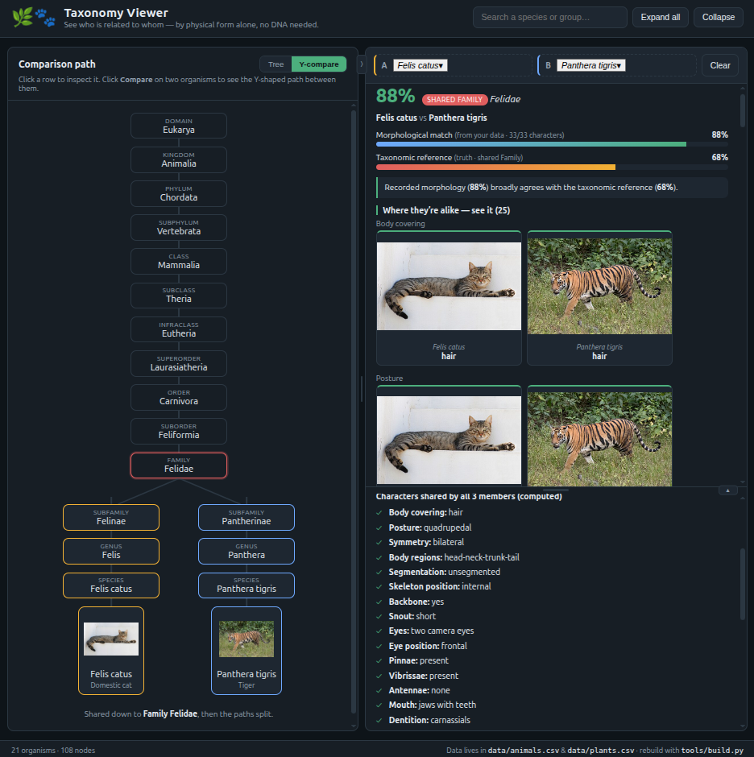

# 🌿🐾 Morphology-First Taxonomy Viewer

A small, offline-first tool that shows **which species are close to which — using only
physical/morphological classification**, the way naturalists worked for 250 years before DNA
sequencing existed. No sequencing machine required in the field: shared body plans, organs and
structures are still gold.



Pick two organisms and the tool draws a **vertical Y-shaped path** from their shared ancestor down
to each one, and gives you **two closeness numbers**:

- **Taxonomic reference** — the "truth" level, read from the rank at which they still share a branch.
- **Morphological match** — computed *directly from the trait values you record* in the datasets.

Comparing the two tells you something real: if the morphological match is *lower* than the
taxonomic reference, your recorded characters don't yet capture the known relationship — **you need
more data**. If it's *much higher* (like two mosquitoes that look identical), morphology alone can't
separate them — that's what a "species complex" means.

```
                 Class · Mammalia          ← shared down to here
                    /        \
          Order Primates   Order Rodentia
              |                 |
        Family Hominidae   Family Muridae
              |                 |
          Genus Homo        Genus Mus
              |                 |
        [img] Homo sapiens  [img] Mus musculus
```

## What it answers, out of the box

| Comparison | Morphological match | Taxonomic reference | What it means |
|---|---|---|---|
| Human vs Mouse | 62% | 51% (Superorder Euarchontoglires) | Both euarchontoglire mammals, but visibly differ (posture, size, snout, diet…). |
| Lion vs Tiger | 90% | 81% (Genus *Panthera*) | Very close; differ mainly in the tiger's stripes. |
| Cat vs Dog | 94% | 54% (Order Carnivora) | Shared carnivore body plan; split into cat/dog suborders. |
| *Culex pipiens* vs *C. quinquefasciatus* | 100% | 97% (Species complex) | **Cryptic species** — visible characters can't separate them → **need finer traits**. |
| Wheat vs Rye | 100% | 76% (Tribe Triticeae) | Same recorded grass form; very close. |
| Wheat vs Pea | 26% | 22% (Subphylum Spermatophytina) | Morphology agrees with the monocot/eudicot split. |
| Human vs Bamboo | n/a | 3% (Domain Eukarya) | No shared characters — animal vs plant trait sets don't overlap. |

## Run it

No build, no server, no internet needed.

```bash
# 1. Build the browser dataset from the CSVs (and validate the lineages)
python3 tools/build.py

# 2. (optional) Pull one openly-licensed photo per species into images/
#    Skips any already present; missing photos fall back to a labelled placeholder.
python3 tools/fetch_images.py

# 3. Open the app — just double-click index.html, or:
xdg-open index.html      # Linux
open index.html          # macOS
```

The repo already ships with a photo for every seed species, so step 2 is only
needed after you add new organisms. Once the images are on disk the app is fully
offline — no network is touched at view time.

## How to use

- **Tree view** (left): browse the tree of life; click a ▸ to expand, click a row to inspect it.
- **Inspect** a species → its recorded morphological characters + picture. Inspect a **group**
  (e.g. Family Poaceae) → the characters *computed* to be shared by every member, plus a browsable
  list of all species under it.
- **Compare**: hover a row → **Compare** (or use the quick-example buttons) to fill slots A and B.
  The left panel switches to the **Y-diagram** (shared spine, then the fork to each organism), and
  the right panel shows the two similarity bars, an interpretation, and both the **shared** and the
  **differing** characters as cards. **A shared *absence* is not shown as a shared trait** — if both
  organisms simply lack a feature (a human and a cat both scored `antennae: none`), that character is
  dropped from "Where they're alike", because a mutual *nothing* is not a visible shared character. The
  same feature still appears under "Where they differ" whenever one side has it and the other doesn't
  (a mosquito's `antennae` vs a human's). Every card shows the **two real organisms side by side** (A on
  the left, B on the right), each labelled with its value for that character. Media connect purely by
  file name — drop a real close-up (photo, **GIF/animation**, or **short video**) at
  `images/<species>/<trait>.jpg` and it replaces the whole-body photo on that one card. Click any
  image to **zoom**.
- **Compare whole groups, not just species.** The A/B slot picker lists **every taxon** — species
  *and* groups (each group tagged with its rank, e.g. `Family` *Felidae*) — so you select a group into
  a slot exactly like an organism. A group is summarised by the characters *all* its members share, so
  Family *Felidae* vs Family *Canidae*, or Mammals vs Insects, is a valid comparison. (The tree
  **Compare** buttons and the "compare whole groups" examples do the same thing.)
- **Resize & collapse the panels** (like an IDE): drag the divider between the tree and the detail
  panels to re-balance them, and the divider between the comparison and details to re-balance those.
  Double-click a divider to reset it; use the small button on a divider to collapse or expand that
  region. Toggle **Tree / Y-compare** any time with the buttons above the left panel.
- **Search** by common or scientific name in the top bar.

## Project layout

```
taxonomy_viewer/
├── index.html              # the app shell
├── css/styles.css          # styling
├── js/app.js               # tree, Y-diagram, similarity engine (vanilla JS, no deps)
├── js/panels.js            # resizable / collapsible panel dividers
├── .gitignore              # keeps OS cruft & internal working files out of the repo
├── data/
│   ├── animals.csv         # ← EDIT THIS. One row per animal. Visible traits only.
│   ├── plants.csv          # ← EDIT THIS. One row per plant.  Visible traits only.
│   ├── lineage_ref.csv     # the shared taxonomy (name,rank,parent) — extended ranks
│   └── dataset.js          # auto-generated (window.DATASET) so file:// works offline
├── tools/build.py          # reads the CSVs → dataset.js (+ validates the tree)
├── tools/fetch_images.py   # fetch species photos + write images/CREDITS.md
├── images/
│   ├── <slug>.jpg          # each organism's main photo
│   ├── <slug>/             # that organism's per-character close-ups (photo/gif/video)
│   ├── README.md           # ← image naming convention (read before adding media)
│   └── CREDITS.md          # author + licence + source for every third-party photo
└── docs/DATABASE.md        # how to organize & grow the datasets, and where to get data
```

## Adding organisms & characters (spreadsheet-friendly)

The two CSVs are a **field-collection template** — grow them freely:

- **Add a row** for each organism you record. You only need its `species` (full binomial); the whole
  lineage is filled in from `data/lineage_ref.csv` by walking the genus up its `parent` chain. What you
  add to `lineage_ref.csv` depends on how much of the branch already exists:
  - **Genus already there** (e.g. another *Panthera*) → nothing to add; the lineage is inherited.
  - **New genus, but its family/order/… already there** → add the **one** missing line:
    `Newgenus,genus,<existing parent>`.
  - **A whole new branch** (a class/order not represented yet, e.g. a bird) → add a **connected chain**
    of `name,rank,parent` rows from the new genus **up to the nearest taxon already in the file**
    (reuse the existing higher ranks — only add what's missing). Every organism must climb to at least
    its **phylum** so it shares a real ancestor (LCA) with the rest of the tree; `tools/build.py`
    **fails with a pointer to the dangling `parent`** if a lineage stops short. A worked example is in
    **[docs/DATABASE.md](docs/DATABASE.md)**.
- **Add a column** for any **visible** character you can score by eye / camera / ruler. Only visible
  traits by design — no dissection, microscope or lab (see [docs/DATABASE.md](docs/DATABASE.md)). It's
  a scope, not a limit: the same maths runs on whatever you add, and a richer set just tightens the
  morphology↔taxonomy gap (less under/over-fitting — good for teaching).
- **Leave cells blank** for anything you didn't observe — blanks are skipped, partial data is fine.
- Then run `python3 tools/build.py`. Animals and plants are **separate files on purpose** (a plant has
  no `dentition`, an animal no `leaf_venation`).

Add photos/GIFs/short videos per organism and per character by file name — the exact, **must-match**
convention is in **[images/README.md](images/README.md)**. Where to pull reliable classifications
(GBIF, Catalogue of Life, POWO, ITIS) is in **[docs/DATABASE.md](docs/DATABASE.md)**.

### How fine should a character be? (flat columns vs. nested traits)

Two organisms can "share" a character and still look quite different *within* it. A human and a cat
both have **body hair**, but the hair differs in length, density, colour pattern, and texture. So a
single `body_covering: hair` column marks them as identical on that trait when, visibly, they aren't.
There are two ways to capture that extra detail, and this project deliberately chooses the first:

- **Flat columns (what we do).** Split a character into more **visible sub-characters, each its own
  column** — e.g. `hair_length`, `hair_density`, `hair_pattern` beside `body_covering`. It stays a
  plain spreadsheet anyone can edit, every field feeds the Gower maths directly with no special
  handling, and blank cells are simply skipped. The cost is **width**: the more nuance you want, the
  more columns the CSV grows, and a fully-blank column just won't render until at least one row fills
  it. In practice this is fine — you add columns only for the distinctions you actually want (and/or can observe) the
  similarity score to *see*.

- **Nested per-trait properties (a JSON structure — considered, not used).** You *could* instead give
  each trait an object of sub-properties, e.g.
  `"body_hair": { "present": true, "length": "short", "colour": "tawny" }`, keeping related detail
  bundled under one key. It reads tidily and models "a trait with attributes" more faithfully. But it
  makes the data **less intuitive to edit** (no longer a flat sheet you can open in any spreadsheet),
  **harder to maintain** (every consumer must know each trait's inner shape, and the similarity engine
  needs per-trait logic to weigh nested fields), and it blurs the project's field-collection goal —
  score one visible thing per cell. For a teaching tool meant to be grown by hand in a spreadsheet, the
  flat "one more column" path wins; the nested design is noted here as the road not taken.

## License & credits

The **code and dataset** in this repository are under its `LICENSE`. The **species photos** in
`images/` are **not** — each is a third-party Wikimedia Commons / Wikipedia image under **its own
licence** (CC BY, CC BY-SA, GFDL, or public domain), and reusing one means following that licence and
crediting its author. Every photo's author, licence and source are listed in
**[images/CREDITS.md](images/CREDITS.md)** (regenerate with `python3 tools/fetch_images.py --credits`).

## The idea in one line

Two truths, side by side: **how deep two organisms share a branch** (taxonomy) versus **how alike
the morphology you actually recorded is** (data). The gap between them is where the science —
convergence, cryptic species, or simply missing measurements — becomes visible, no DNA required.
